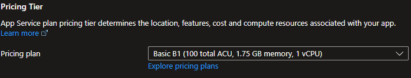

# Overview of Azure Cloud Shell ☁

The Azure cloud shell is a shell environment run directly from the Azure portal. It is a browser-based shell where you can run commands to work with Azure resources. If you prefer Bash, you can use the Bash shell. If you prefer PowerShell, you can use the PowerShell shell. 

## Main Features of Azure Cloud Shell ✔

+ Temporary environment that requires a new or existing Azure file share to be mounted
+ Automatically authenticated with your Azure subscription
+ Times out after 20 minutes of inactivity
+ Uses the same file share for Bash and PowerShell
+ Is assigned to one machine per user account
+ Persist $HOME using a 5-GB image in Azure Files

## How to Access Azure Cloud Shell 🚀

+ https://shell.azure.com
+ Click on the Cloud Shell icon in the Azure portal



## First time setup 🛠

This will be a one-time set up and automatically attached for all sessions. Even though Cloud Shell machines are temporary, the files are persisted in two ways:
+ Disk image in Azure Files
+ Mounted file share named clouddrive

## Manage Azure Subscriptions 

The Get-AzSubscription cmdlet gets the subscriptions for the account. You can use this cmdlet to get the subscriptions for the account, and then use the Select-AzSubscription cmdlet to select a default subscription for the current session.

```powershell

Get-AzSubscription

Name                               Id                      TenantId                        State
----                               --                      --------                        -----
Subscription1                      yyyy-yyyy-yyyy-yyyy     aaaa-aaaa-aaaa-aaaa             Enabled
Subscription2                      xxxx-xxxx-xxxx-xxxx     aaaa-aaaa-aaaa-aaaa             Enabled
Subscription3                      zzzz-zzzz-zzzz-zzzz     bbbb-bbbb-bbbb-bbbb             Enabled
```

If your tenant has multiple subscriptions, you will find youself switching between them constantly. To focus on a specific subscription, use the Select-AzSubscription cmdlet.

```powershell

Set-AzContext -Subscription "xxxx-xxxx-xxxx-xxxx"

```

## Working with Azure Resources

Once you have selected the desired subscription, you can start working with Azure resources using Azure Cloud Shell. Here are a few examples of common tasks:

### Creating a Resource Group

To create a new resource group, use the `New-AzResourceGroup` cmdlet. Specify the name and location for the resource group.

```powershell
New-AzResourceGroup -Name "myResourceGroup" -Location "East US"
```

### Creating a Virtual Machine

To create a new virtual machine, use the `New-AzVM` cmdlet. Provide the necessary parameters such as the resource group, name, location, and image.

```powershell
New-AzVM -ResourceGroupName "myResourceGroup" -Name "myVM" -Location "East US" -Image "UbuntuLTS"
```

### Managing Storage Accounts

To manage storage accounts, you can use the `New-AzStorageAccount`, `Get-AzStorageAccount`, and `Remove-AzStorageAccount` cmdlets. These cmdlets allow you to create, retrieve, and delete storage accounts respectively.

```powershell
New-AzStorageAccount -ResourceGroupName "myResourceGroup" -Name "mystorageaccount" -Location "East US" -SkuName "Standard_LRS"
```

```powershell
Get-AzStorageAccount -ResourceGroupName "myResourceGroup"
```

```powershell
Remove-AzStorageAccount -ResourceGroupName "myResourceGroup" -Name "mystorageaccount"
```

### Managing Virtual Networks

To manage virtual networks, you can use the `New-AzVirtualNetwork`, `Get-AzVirtualNetwork`, and `Remove-AzVirtualNetwork` cmdlets. These cmdlets allow you to create, retrieve, and delete virtual networks respectively.

```powershell
New-AzVirtualNetwork -ResourceGroupName "myResourceGroup" -Name "myVirtualNetwork" -Location "East US" -AddressPrefix "10.0.0.0/16"
```

```powershell
Get-AzVirtualNetwork -ResourceGroupName "myResourceGroup"
```

```powershell
Remove-AzVirtualNetwork -ResourceGroupName "myResourceGroup" -Name "myVirtualNetwork"
```

Feel free to explore more Azure resources and their corresponding cmdlets using Azure Cloud Shell.
