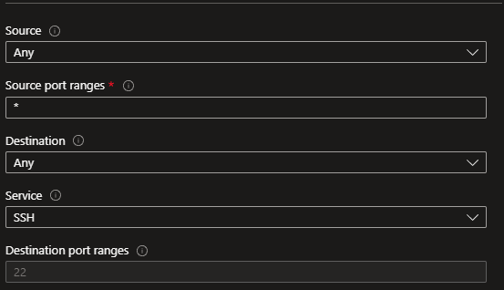
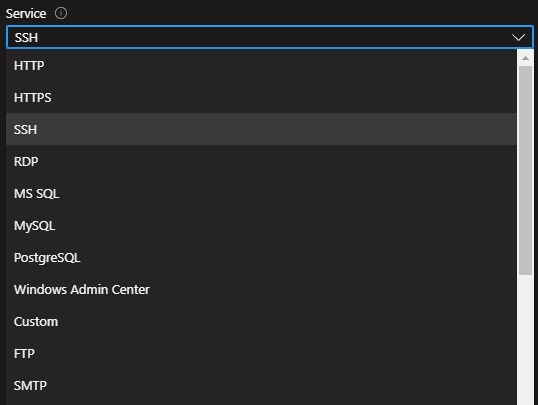
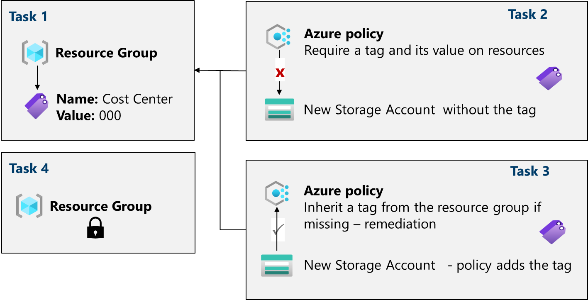
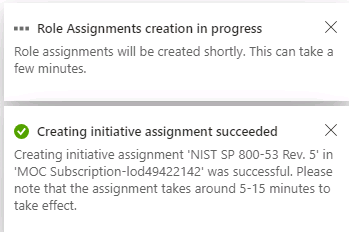

# Configure Azure Disk Encryption

Head over to https://www.portal.azure.com and type in Key Vault in ths search bar.

**Remember** we have to have a key vault to store our encryption secret. Even if you are or are not using your own encryption key. 🗝️

First thing - Key vault is used to store secret information. Think encryption keys, API keys, passwords, etc. 

**Resource Group** Try to follow a good naming schema, because if you are like me..your lab environment is probably pretty messy. 

**Region** For Azure Disk Encryption, it must be in the same region that your Virtual Machine is. 

For the other instance details, you may leave them as is or set them appropriately. 

On the **Acess configuration** page, we do need to have access to this vault for the purpose of disk encryption. Therefore, select the box that says "Azure Disk Encryption for volume encryption" 

You can leave the remainder of the congfiguration defaults as it, review your settings, and then click create. Once complete, you should get a message similar to this. 

Now that the Key Vault has been created, go back the portal and into your virtual machines. (I did start one of my VMS for this walk through, so make sure you have a VM running.)

**Lets now set up Azure Disk Encryption** 

Then you will click on **additional settings**

You will see two options.

**1. Encrypt the OS disk**

**2. Encrypt the OS and data disks**

For the purpose of this walk through, we are only going to choose the OS disk because that is all we have. Then we have to choose the key vault. 

If you do not see the Key Vault you created in the drop down menu, that means your virtual machine and key fault are <u>**not in the same region.**</u>

You will see there is an option to select a key, but you don't need to. That is an additional key that will encrypt the *encryption secret* that is being stored in your key vault. (For my military friends, you might know this as "KEK"). For everyone else, this is also known is a customer managed key (CMK). 

If you wanted to use this key mentioned, you will have to enable Azure RBAC configured for Data layer access to this key vault. You can do that by accessing IAM. Click create and once it's complete, you will be able to see your disk is secure in two different ways. 

It is secure on the server **(SSE)** side which is the data at rest in Microsoft's global infrastructure. 🌍

We also have Azure Disk Encryption **(ADE)** which we enabled in Azure Key Vault. 🗝️