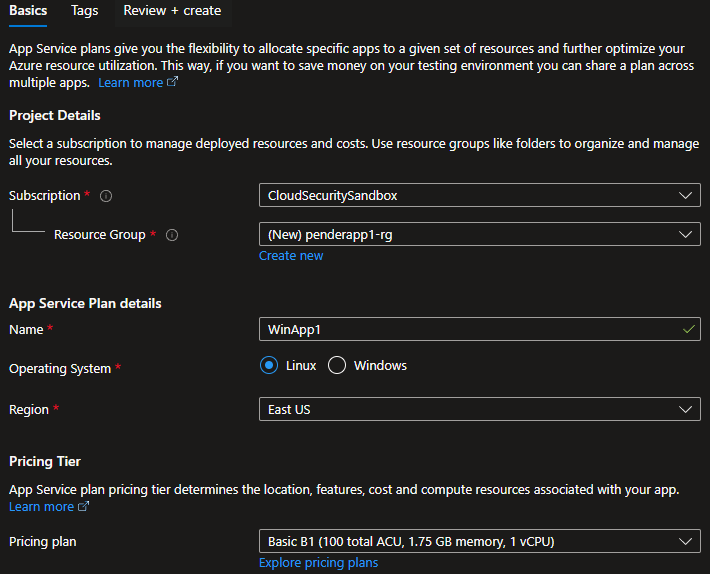
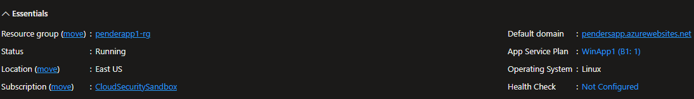
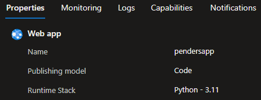
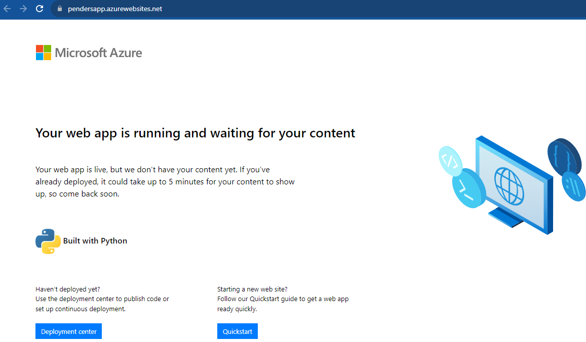
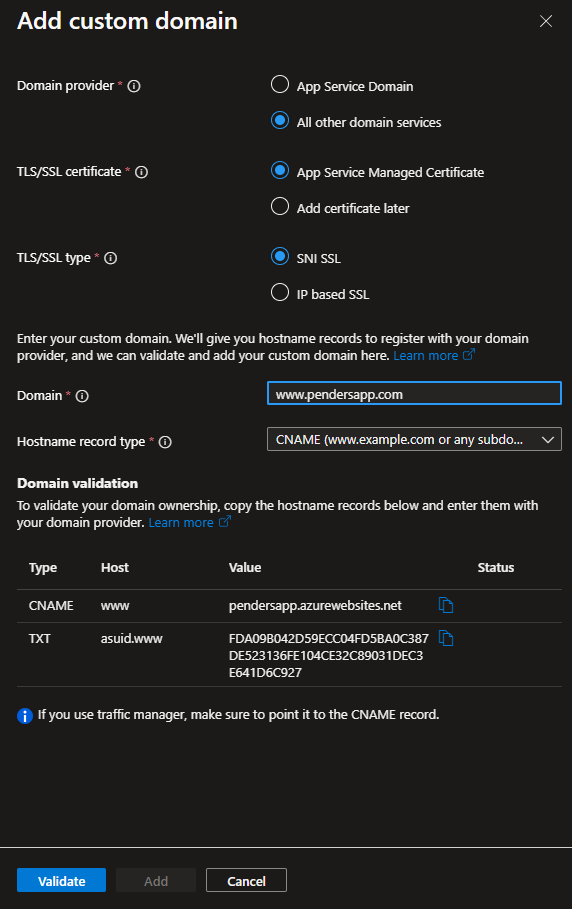
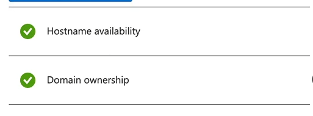

<<<<<<< HEAD
### Step 1: Set Up Your Azure Account 🌐
If you don't have an Azure account yet, sign up at [Azure Portal](https://portal.azure.com). If you have an account, log in!

### Step 2: Navigate to Azure App Services 
Think of this as creating the underlying infrastructure for the Web Application, not actually building the app itself. We will just be building the components.
1. Click on the ☰ hamburger menu in the top-left corner.
2. Select "Create a resource."
3. Click on "App Service Plan."

### Step 3: Configure Your Web App 🛠️
1. **Subscription**: Choose your subscription plan.

2. **Resource Group**: Click on "Create new" and give it a name, or select an existing one.
3. **Name**: Choose a unique name for your app.
4. **Operating System**: Select Windows or Linux, whichever you prefer. The OS determines the underlying operating system (OS) that will provide the execution environment for the Web App. 
5. **Runtime Stack**: Choose the coding language and version you want to use (e.g., .NET, Node.js).
6. **Region**: Pick a region close to you or your target audience.

### Step 4: Select App Service Plan and Sku 📝
1. Click on "Explore pricing plans" under the **Pricing Tier**.

2. You can choose a dev/test plan or a production plan, depending on your needs. For this lab, we will choose Basic B1 to keep costs low. 
3. Click "Apply."

### Deply An App 💻

1. **Create Web App**: Go to create a resource, and create web app. 
2. **Configure Settings**: This is the actual app. Here you will configure what DNS entry we want, what deployment method we use, & run time. 
3. **Region**: It is always best to deploy apps to the same application service plan, and the same resource group, and they have to be in the region. 
4. **Create**: Click review and create. 

In the screenshot above, you can see the DNS entry we created. Below you can see the runtime stack we configured as well. 

### View Status of Configuration

If you go and click on the link that has been created for us based on the DNS entry that we configured in previous steps, you should see screen like this:

It will show you the boiler plate Python code that Microsoft has provided and a quick status message. 

### Optional: Create Custom Domain Name

1. **Click on Custom Domain**: Click the + sign for Add custom domain. Type in the custom name that you want. 

This will provide you all of the details that you need to add this to a DNS provider. 
*By default* it will give you a CNAME record which means your website will start with www but if you wanted a root or APEX level custom domain, you would use an A record. 
For the purpose of this lab, we will use a CNAME record. 

2. You will then have to go to your DNS provider & configure a CNAME record and a TXT record for that CNAME record to provide verification.
3. Take a copy of your CNAME record, go back to your Azure environment and create a new record set. Quickly follow these steps in the link below. 

https://learn.microsoft.com/en-us/azure/dns/dns-getstarted-portal

### Step 6: Validate DNS Records ⚙️
1. Once you are finished with creating a custom domain, click on validate. If successful, you should see two green check marks:
  

This verifies that it was able to look up the DNS records in your DNS provider and it is ready to go. 

### Summary 🎉
We have configured an Azure App Service Plan. Deployed a Web App to the Web Service Plan using the Python runtime environment. We also configured a custom domain. 

### Step 8: Visit Your Web App 🌐
1. Go to the "Resource groups" in the Azure portal.
2. Click on your resource group.
3. Click on your web app name.
4. Click on the URL at the top-right to open your web app in a new browser tab.

Congratulations, you've created a web app using Azure App Service Plan! 🥳 Now you can customize it as you wish and start building something awesome. If you encounter any issues or have further questions, the [Azure documentation](https://docs.microsoft.com/en-us/azure/app-service/) is a great resource.
=======
### Step 1: Set Up Your Azure Account 🌐
If you don't have an Azure account yet, sign up at [Azure Portal](https://portal.azure.com). If you have an account, log in!

### Step 2: Navigate to Azure App Services 
Think of this as creating the underlying infrastructure for the Web Application, not actually building the app itself. We will just be building the components.
1. Click on the ☰ hamburger menu in the top-left corner.
2. Select "Create a resource."
3. Click on "App Service Plan."

### Step 3: Configure Your Web App 🛠️
1. **Subscription**: Choose your subscription plan.

2. **Resource Group**: Click on "Create new" and give it a name, or select an existing one.
3. **Name**: Choose a unique name for your app.
4. **Operating System**: Select Windows or Linux, whichever you prefer. The OS determines the underlying operating system (OS) that will provide the execution environment for the Web App. 
5. **Runtime Stack**: Choose the coding language and version you want to use (e.g., .NET, Node.js).
6. **Region**: Pick a region close to you or your target audience.

### Step 4: Select App Service Plan and Sku 📝
1. Click on "Explore pricing plans" under the **Pricing Tier**.

2. You can choose a dev/test plan or a production plan, depending on your needs. For this lab, we will choose Basic B1 to keep costs low. 
3. Click "Apply."

### Deply An App 💻

1. **Create Web App**: Go to create a resource, and create web app. 
2. **Configure Settings**: This is the actual app. Here you will configure what DNS entry we want, what deployment method we use, & run time. 
3. **Region**: It is always best to deploy apps to the same application service plan, and the same resource group, and they have to be in the region. 
4. **Create**: Click review and create. 

In the screenshot above, you can see the DNS entry we created. Below you can see the runtime stack we configured as well. 

### View Status of Configuration

If you go and click on the link that has been created for us based on the DNS entry that we configured in previous steps, you should see screen like this:

It will show you the boiler plate Python code that Microsoft has provided and a quick status message. 

### Optional: Create Custom Domain Name

1. **Click on Custom Domain**: Click the + sign for Add custom domain. Type in the custom name that you want. 

This will provide you all of the details that you need to add this to a DNS provider. 
*By default* it will give you a CNAME record which means your website will start with www but if you wanted a root or APEX level custom domain, you would use an A record. 
For the purpose of this lab, we will use a CNAME record. 

2. You will then have to go to your DNS provider & configure a CNAME record and a TXT record for that CNAME record to provide verification.
3. Take a copy of your CNAME record, go back to your Azure environment and create a new record set. Quickly follow these steps in the link below. 

https://learn.microsoft.com/en-us/azure/dns/dns-getstarted-portal

### Step 6: Validate DNS Records ⚙️
1. Once you are finished with creating a custom domain, click on validate. If successful, you should see two green check marks:
  

This verifies that it was able to look up the DNS records in your DNS provider and it is ready to go. 

### Summary 🎉
We have configured an Azure App Service Plan. Deployed a Web App to the Web Service Plan using the Python runtime environment. We also configured a custom domain. 

### Step 8: Visit Your Web App 🌐
1. Go to the "Resource groups" in the Azure portal.
2. Click on your resource group.
3. Click on your web app name.
4. Click on the URL at the top-right to open your web app in a new browser tab.

Congratulations, you've created a web app using Azure App Service Plan! 🥳 Now you can customize it as you wish and start building something awesome. If you encounter any issues or have further questions, the [Azure documentation](https://docs.microsoft.com/en-us/azure/app-service/) is a great resource.
>>>>>>> 120be04 (NetworkSecurityGroups)
