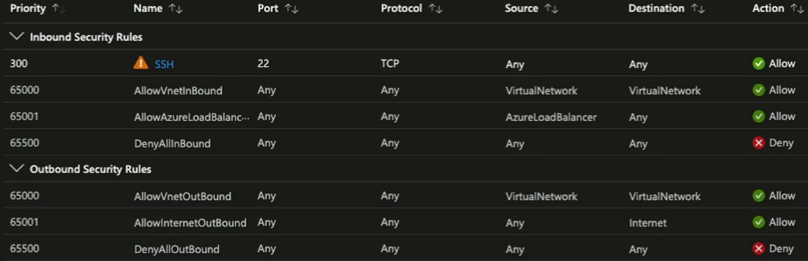
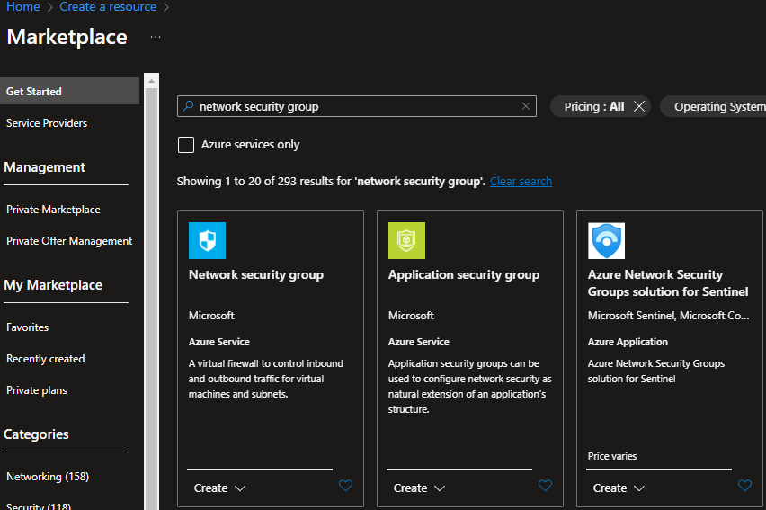
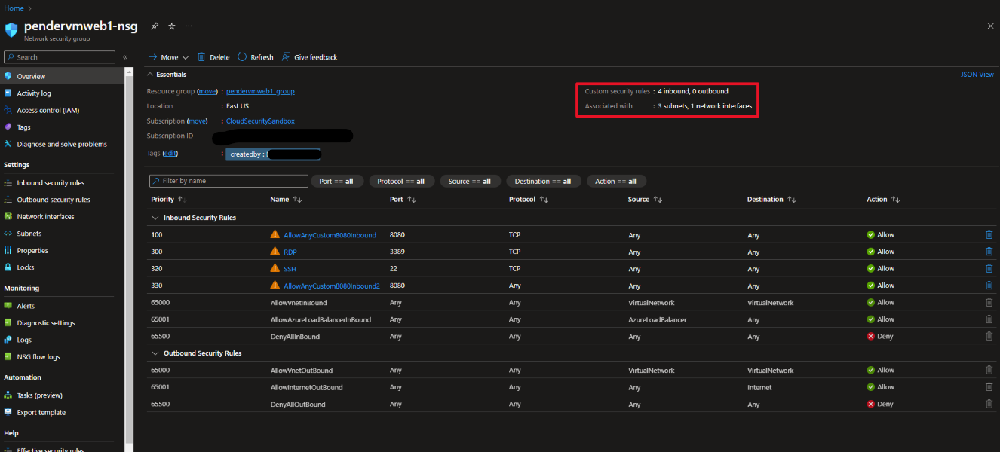
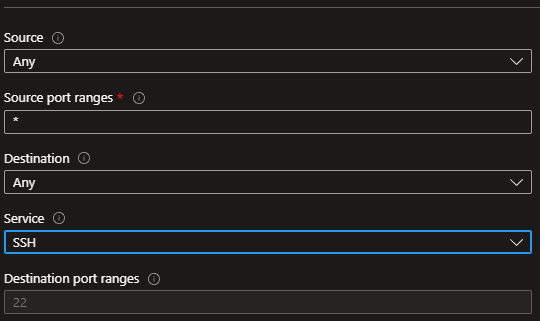
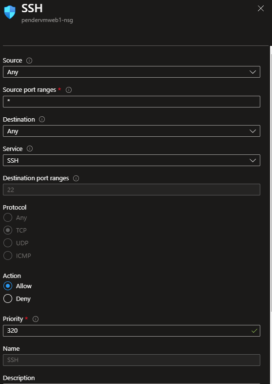
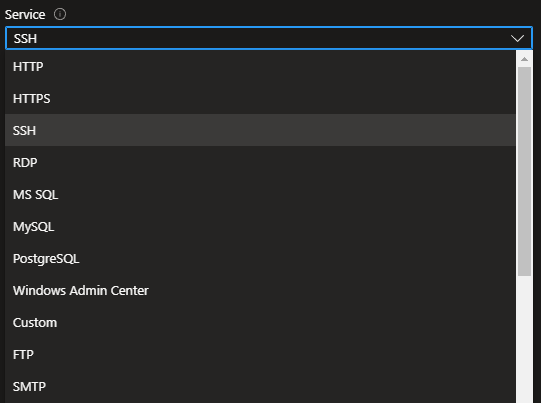
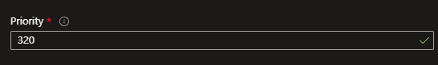
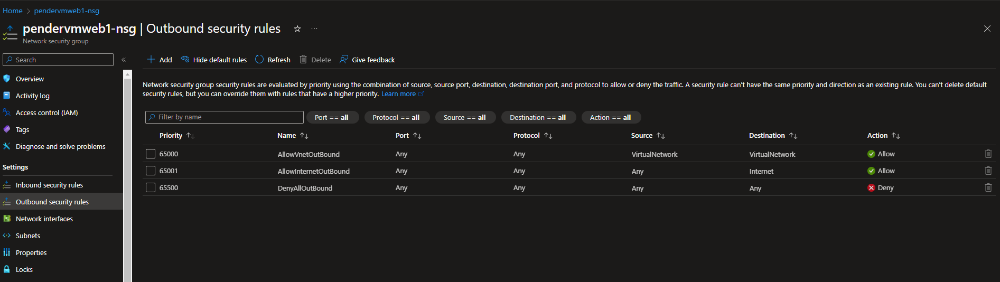

# Creating Network Security Groups

This guide will walk you through the process of creating and configuring Network Security Groups (NSGs) in Microsoft Azure. 📝

## Prerequisites

- An active Azure subscription.
- Basic understanding of networking concepts.

## Overview

Network Security Groups (NSGs) act as a virtual firewall for your network resources in Azure, controlling inbound and outbound traffic. NSGs use rules similar to ACLs (Access Control Lists) to allow or deny specific traffic. 

Did you know that when you create Network Security Groups in #Azure there are rules created by **default?** If you want to override any of these rules, you will have to use <u>priority</u> to do so. Let's break it down. 🔨

Look at the bottom rule of Inbound Security Rules. Unless you have another rule configured (like the one picture with the caution symbol next to it), all traffic will be denied. 🚫

By default, there are rules in the inbound & outbound rules that allow connectivity between virtual networks and subnets. There is also a rule for an Azure Load Balancer because if you associate a load balancer with a device within your network you typically want that traffic to be allowed. ✅

Under Outbound security rules, we have "Allowinternetoutbound" which means by default you will get traffic that is allowed to the internet. ✅

There are two default deny all inbound & outbound rules. This is key to what an NSG does because it blocks everything except for what you allow to pass. If these two default rules that are denying all inbound and outbound traffic were not absent, then the NSG would not really be doing that much.

This is a lot easier than manually inputting everything that you would allow, right? 😁

## Creating a Network Security Group

Step 1: Log into Azure Portal
Navigate to Azure Portal and log in with your credentials.

Step 2: Create a New Resource
Click on the + Create a resource button.
Search for "Network Security Group" and select it.

Step 3: Configure NSG
Select your Subscription and Resource Group.
Enter a name for the NSG.
Choose a region.
Click on Review + Create.

## Assigning Rules

<U>Inbound Rules:</u>
Click on your newly created NSG. Here in the overview section under the essentials, you can see a quick rundown of the subnets & network interfaces your NSG is associated with as well as any custom security rules. As I mentioned earlier, this is also where you will see the default inbound and outbound rules that are created by Microsoft. 

Navigate to Settings -> Inbound security rules.
Click on + Add. For this example, we will add allow SSH inbound connections. Please note this is a controlled lab environment and you should never allow the source to be "Any", but for the sake of saving time, I am going to use Any as the source. 

**You can't remove the default security rules, but you can override them by creating another rule with a higher priority setting.**

## Properties to specify for security rules

- **Source:** the source will identify how the controls inbound traffic. It can be a specific IP address, any resource, IP address range, application security group, or a default tag that is allowed or denied. 

- **Destination:** the destination will identify how the rule controls outbound traffic. It can be specified as a destination IP address, any resource, IP address range, app application security group, or a default tag that is allowed or denied. 

- **Service:** the service will identify the destination protocol and port ranges for the security rule. There are services you can pick, or you can choose predefined ones like RDP or SSH or even use custom port ranges. 

- **Priority:** the priority will assign an order value for the security rule. The lower the number....the higher the priorty. Rules are processes according to their priority order. 

After entering the rule details such as Source, Destination, Ports, Action, etc. click Add. Outbound rules in Microsoft Azure control and manage outgoing network traffic from resources running in your Azure environment. They are essential for ensuring network security, compliance, and resource management. 

<u>Outbound Rules:</U>
Navigate to Settings -> Outbound security rules. Here you will see the three rules that were created by default by Microsoft and their priorities. 
Click on + Add.
Enter the rule details similar to inbound rules.
Click Add.

🔑 Key Points to remember:

- The security rules for a network security group are processed in priority order. 
- When an NSG is created, Azure creates the default security rule "DenyAllInbound" for the group.
- NSG inbound rules for a subnet in a VM take precedence over NSG inbound rules for a NIC in the same VM.

