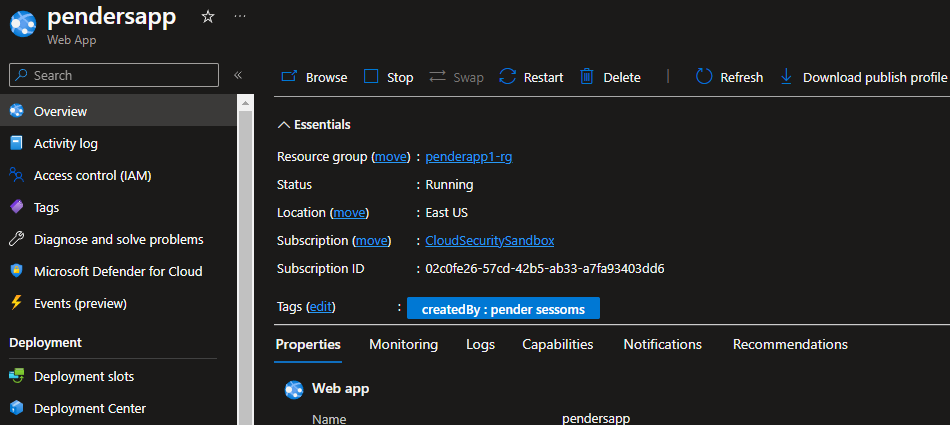

# Configuring Uniform Virtual Machine Scale Sets

Head over to https://www.portal.azure.com and type in VMSS for Virtual Machine Scale Sets in ths search bar. 

Click Create and name the resource group as well as the scale set. Try to use a naming schema that you are familiar with. 

![Alt text][def]

[def]: image-1.png

It is important to remember that with VMSS that you can have <u>regional deployments </u> OR you can <u>pin it across multiple availability zones.</U>

If you will notice, this is the same as configuring a virtual machine. The only difference is that we are defining the standards for our VM scale set instances. 

Click next and keep the disk information the same. On *Networking* we will deploy to an existing virtual network. We will modify the definition of the network interface card. 

Please note the NIC network security group setting is set to *"None"* because this VNET already has one. By default, Public IP addresses are <u>disabled</u> and this is because you will need to use a load balancer in front of it. It is the central access point into the solution that you're hosting. Each VMSS will have a public ip address. 

For demonstration purposes...even though it might be tempting...*do not select Azure Load Balancer* on the next screen. 

We will set the initial instance count to 0 so that we don't have any instances up and running when we actually create the scale set. Let's also leave the scaling polocy at Manual scaling for now. Click on review and create. 

From here, lets change that number from 0 to 2 and click save. Then on your left hand menu, click on instances. You should see two VMSSS being created or already running. 

These instances were created based on the definition we created for our scale set. The size, the disks, the networking parameters, etc. These two VMSS have those mirror configurations and thats why we use scale sets. It is easy to create instances quickly that are for serving the same purpose. 
